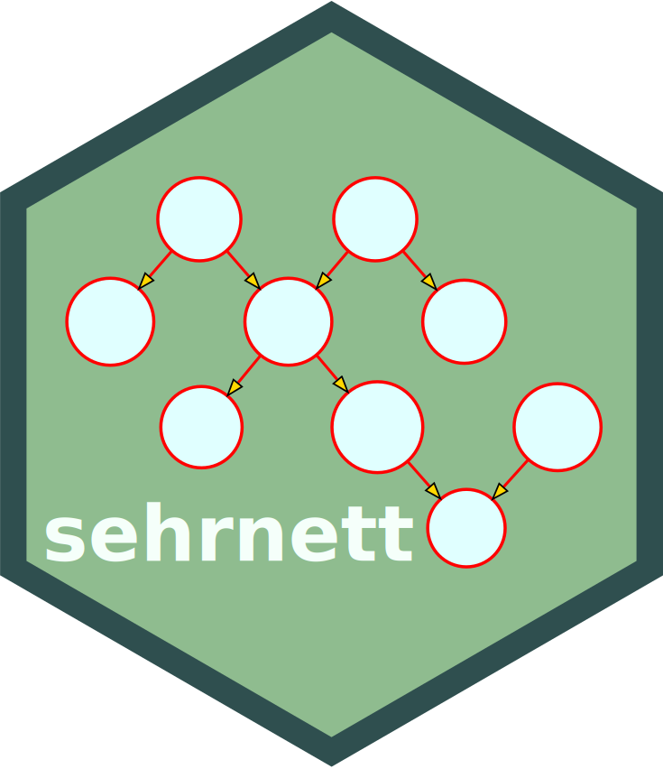

<!-- README.md is generated from README.Rmd. Please edit that file -->

# sehrnett 

<!-- badges: start -->

[](https://github.com/chainsawriot/sehrnett/actions)
[](https://app.codecov.io/gh/chainsawriot/sehrnett?branch=master)
[](https://CRAN.R-project.org/package=sehrnett)
<!-- badges: end -->

The goal of sehrnett is to provide a nice (and fast) interface to
[Princeton’s WordNet](https://wordnet.princeton.edu/). Unlike the
original [wordnet package](https://cran.r-project.org/package=wordnet)
(Feinerer et al., 2020), you don’t need to install WordNet and / or
setup rJava.

The data is not included in the package. Please run `download_wordnet()`
to download the data (\~100M Zipped, \~400M Unzipped) from the Internet,
if such data is not available. Please make sure you agree with the
[WordNet
License](https://wordnet.princeton.edu/license-and-commercial-use).

## Installation

``` r
devtools::install_github("chainsawriot/sehrnett")
```

## `get_lemmas`

The most basic function is `get_lemmas`. It generates basic information
about the lemmas \[1\] you provided.

``` r
library(sehrnett)
```

``` r
get_lemmas(c("very", "nice"))
#> # A tibble: 10 × 6
#>     synsetid lemma sensenum definition                             pos   lexdo…¹
#>        <int> <chr>    <int> <chr>                                  <chr> <chr>  
#>  1 400032295 very         1 used as intensifiers; real' is someti… r     adv.all
#>  2 400513282 very         2 precisely so                           r     adv.all
#>  3 301845232 very         1 precisely as stated                    s     adj.all
#>  4 302076350 very         2 being the exact same one; not any oth… s     adj.all
#>  5 301590750 nice         1 pleasant or pleasing or agreeable in … a     adj.all
#>  6 108957024 nice         1 a city in southeastern France on the … n     noun.l…
#>  7 302000490 nice         2 socially or conventionally correct; r… s     adj.all
#>  8 301844650 nice         3 done with delicacy and skill           s     adj.all
#>  9 300987524 nice         4 excessively fastidious and easily dis… s     adj.all
#> 10 300644482 nice         5 exhibiting courtesy and politeness     s     adj.all
#> # … with abbreviated variable name ¹​lexdomain
```

``` r
get_lemmas("nice")
#> # A tibble: 6 × 6
#>    synsetid lemma sensenum definition                              pos   lexdo…¹
#>       <int> <chr>    <int> <chr>                                   <chr> <chr>  
#> 1 301590750 nice         1 pleasant or pleasing or agreeable in n… a     adj.all
#> 2 108957024 nice         1 a city in southeastern France on the M… n     noun.l…
#> 3 302000490 nice         2 socially or conventionally correct; re… s     adj.all
#> 4 301844650 nice         3 done with delicacy and skill            s     adj.all
#> 5 300987524 nice         4 excessively fastidious and easily disg… s     adj.all
#> 6 300644482 nice         5 exhibiting courtesy and politeness      s     adj.all
#> # … with abbreviated variable name ¹​lexdomain
```

``` r
get_lemmas("nice", pos = "n")
#> # A tibble: 1 × 6
#>    synsetid lemma sensenum definition                              pos   lexdo…¹
#>       <int> <chr>    <int> <chr>                                   <chr> <chr>  
#> 1 108957024 nice         1 a city in southeastern France on the M… n     noun.l…
#> # … with abbreviated variable name ¹​lexdomain
```

Please note that some definitions in WordNet are considered pejorative
or offensive, e.g. 

``` r
get_lemmas("dog")
#> # A tibble: 8 × 6
#>    synsetid lemma sensenum definition                              pos   lexdo…¹
#>       <int> <chr>    <int> <chr>                                   <chr> <chr>  
#> 1 102086723 dog          1 a member of the genus Canis (probably … n     noun.a…
#> 2 110133978 dog          2 a dull unattractive unpleasant girl or… n     noun.p…
#> 3 110042764 dog          3 informal term for a man                 n     noun.p…
#> 4 109905672 dog          4 someone who is morally reprehensible    n     noun.p…
#> 5 107692347 dog          5 a smooth-textured sausage of minced be… n     noun.f…
#> 6 103907626 dog          6 a hinged catch that fits into a notch … n     noun.a…
#> 7 102712903 dog          7 metal supports for logs in a fireplace  n     noun.a…
#> 8 202005890 dog          1 go after with the intent to catch       v     verb.m…
#> # … with abbreviated variable name ¹​lexdomain
```

### Dot notation

The dot notation (“lemma.pos.sensenum”) can be used to quick search for
a particular word sense. For example, one can search for “king.n.10” to
quickly pin down the word sense of “king” as a chess piece.

``` r
get_lemmas("king.n.10")
#> # A tibble: 1 × 6
#>    synsetid lemma sensenum definition                              pos   lexdo…¹
#>       <int> <chr>    <int> <chr>                                   <chr> <chr>  
#> 1 103623310 king        10 (chess) the weakest but the most impor… n     noun.a…
#> # … with abbreviated variable name ¹​lexdomain
```

### Lemmatization

The [morphological
processing](https://wordnet.princeton.edu/documentation/morphy7wn) of
the original Wordnet is partially implemented in `sehrnett` \[2\]. As
the Wordnet’s database contains only information about lemmas
(e.g. *eat*), you need to convert inflected variants (e.g. *ate*,
*eaten*, *eating*) back to their lemmas to query them. The process is
otherwise known as
[lemmatization](https://en.wikipedia.org/wiki/Lemmatisation).

`sehrnett` provides such lemmatization. But you need to provide exactly
one `pos` and set `lemmatize` to `TRUE` (default).

``` r
get_lemmas(c("ate", "ducking"), pos = "v")
#> # A tibble: 10 × 6
#>     synsetid lemma sensenum definition                             pos   lexdo…¹
#>        <int> <chr>    <int> <chr>                                  <chr> <chr>  
#>  1 201170802 eat          1 take in solid food                     v     verb.c…
#>  2 201168667 eat          2 eat a meal; take a meal                v     verb.c…
#>  3 201182162 eat          3 take in food; used of animals only     v     verb.c…
#>  4 201770125 eat          4 worry or cause anxiety in a persisten… v     verb.e…
#>  5 201159815 eat          5 use up (resources or materials)        v     verb.c…
#>  6 200275082 eat          6 cause to deteriorate due to the actio… v     verb.c…
#>  7 201869189 duck         1 to move (the head or body) quickly do… v     verb.m…
#>  8 201971799 duck         2 submerge or plunge suddenly            v     verb.m…
#>  9 201980234 duck         3 dip into a liquid                      v     verb.m…
#> 10 200811316 duck         4 avoid or try to avoid fulfilling, ans… v     verb.c…
#> # … with abbreviated variable name ¹​lexdomain
```

``` r
get_lemmas(c("loci", "lemmata", "boxesful"), pos = "n")
#> # A tibble: 7 × 6
#>    synsetid lemma  sensenum definition                             pos   lexdo…¹
#>       <int> <chr>     <int> <chr>                                  <chr> <chr>  
#> 1 108695366 locus         1 the scene of any event or action (esp… n     noun.l…
#> 2 108641143 locus         2 the specific site of a particular gen… n     noun.l…
#> 3 108017323 locus         3 the set of all points or lines that s… n     noun.g…
#> 4 106764547 lemma         1 a subsidiary proposition that is assu… n     noun.c…
#> 5 113176246 lemma         2 the lower and stouter of the two glum… n     noun.p…
#> 6 106356061 lemma         3 the heading that indicates the subjec… n     noun.c…
#> 7 113787764 boxful        1 the quantity contained in a box        n     noun.q…
#> # … with abbreviated variable name ¹​lexdomain
```

``` r
get_lemmas(c("nicest", "stronger"), pos = "a")
#> # A tibble: 3 × 6
#>    synsetid lemma  sensenum definition                             pos   lexdo…¹
#>       <int> <chr>     <int> <chr>                                  <chr> <chr>  
#> 1 301590750 nice          1 pleasant or pleasing or agreeable in … a     adj.all
#> 2 302328781 strong        1 having strength or power greater than… a     adj.all
#> 3 301829730 strong        4 having a strong physiological or chem… a     adj.all
#> # … with abbreviated variable name ¹​lexdomain
```

## A practical example

For example, you want to know the synonyms of the word “nuance” (very
important for academic writing). You can first search using the lemma
“nuance” with `get_lemmas`.

``` r
res <- get_lemmas("nuance")
res
#> # A tibble: 1 × 6
#>    synsetid lemma  sensenum definition                             pos   lexdo…¹
#>       <int> <chr>     <int> <chr>                                  <chr> <chr>  
#> 1 106618544 nuance        1 a subtle difference in meaning or opi… n     noun.c…
#> # … with abbreviated variable name ¹​lexdomain
```

There could be multiple word senses and you need to choose which word
sense you want to convey. But in this case, there is only one. You can
then search for the `synsetid` (cognitive synonym identifier) of that
word sense.

``` r
# get_synonyms() is a wrapper to get_synsetids
get_synsetids(res$synsetid[1])
#> # A tibble: 5 × 6
#>    synsetid lemma      sensenum definition                         pos   lexdo…¹
#>       <int> <chr>         <int> <chr>                              <chr> <chr>  
#> 1 106618544 nuance            1 a subtle difference in meaning or… n     noun.c…
#> 2 106618544 subtlety          1 a subtle difference in meaning or… n     noun.c…
#> 3 106618544 nicety            2 a subtle difference in meaning or… n     noun.c…
#> 4 106618544 refinement        4 a subtle difference in meaning or… n     noun.c…
#> 5 106618544 shade             4 a subtle difference in meaning or… n     noun.c…
#> # … with abbreviated variable name ¹​lexdomain
```

## Chainablilty

All `get_` functions are chainable by using the magrittr pipe operator.

``` r
c("switch off") %>% get_lemmas(pos = "v") %>% get_synonyms
#> # A tibble: 4 × 6
#>    synsetid lemma      sensenum definition                         pos   lexdo…¹
#>       <int> <chr>         <int> <chr>                              <chr> <chr>  
#> 1 201513208 switch off        1 cause to stop operating by diseng… v     verb.c…
#> 2 201513208 turn off          1 cause to stop operating by diseng… v     verb.c…
#> 3 201513208 turn out         11 cause to stop operating by diseng… v     verb.c…
#> 4 201513208 cut              27 cause to stop operating by diseng… v     verb.c…
#> # … with abbreviated variable name ¹​lexdomain
```

## `get_outdegrees`

WordNet is indeed a network. synsetids are connected to each other in a
directed graph. An node (a synsetid) is linked to another with different
link (edge) types labelling with different `linkid`s. You can list out
all available `linkid`s with the function `list_linktypes`.

``` r
list_linktypes()
#>    linkid                   link recurses
#> 1       1               hypernym        1
#> 2       2                hyponym        1
#> 3       3      instance hypernym        1
#> 4       4       instance hyponym        1
#> 5      11           part holonym        1
#> 6      12           part meronym        1
#> 7      13         member holonym        1
#> 8      14         member meronym        1
#> 9      15      substance holonym        1
#> 10     16      substance meronym        1
#> 11     21                 entail        1
#> 12     23                  cause        1
#> 13     30                antonym        0
#> 14     40                similar        0
#> 15     50                   also        0
#> 16     60              attribute        0
#> 17     70             verb group        0
#> 18     71             participle        0
#> 19     80              pertainym        0
#> 20     81             derivation        0
#> 21     91        domain category        0
#> 22     92 domain member category        0
#> 23     93          domain region        0
#> 24     94   domain member region        0
#> 25     95           domain usage        0
#> 26     96    domain member usage        0
#> 27     97                 domain        0
#> 28     98                 member        0
```

``` r
## all hypernyms
get_lemmas("dog", pos = "n", sensenum = 1) %>% get_outdegrees(linkid = 1)
#> # A tibble: 21 × 6
#>     synsetid lemma               sensenum definition               pos   lexdo…¹
#>        <int> <chr>                  <int> <chr>                    <chr> <chr>  
#>  1 102085998 canid                      1 any of various fissiped… n     noun.a…
#>  2 102085998 canine                     2 any of various fissiped… n     noun.a…
#>  3 101320032 domestic animal            1 any of various animals … n     noun.a…
#>  4 101320032 domesticated animal        1 any of various animals … n     noun.a…
#>  5 110759293 disagreeable woman         1 a woman who is an unple… n     noun.p…
#>  6 110759293 unpleasant woman           1 a woman who is an unple… n     noun.p…
#>  7 109927483 blighter                   2 a boy or man             n     noun.p…
#>  8 109927483 bloke                      1 a boy or man             n     noun.p…
#>  9 109927483 chap                       1 a boy or man             n     noun.p…
#> 10 109927483 cuss                       2 a boy or man             n     noun.p…
#> # … with 11 more rows, and abbreviated variable name ¹​lexdomain
```

``` r
## all hyponymes
get_lemmas("dog", pos = "n", sensenum = 1) %>% get_outdegrees(linkid = 2)
#> # A tibble: 35 × 6
#>     synsetid lemma            sensenum definition                  pos   lexdo…¹
#>        <int> <chr>               <int> <chr>                       <chr> <chr>  
#>  1 102087384 barker                  2 informal terms for dogs     n     noun.a…
#>  2 102113458 basenji                 1 small smooth-haired breed … n     noun.a…
#>  3 102115149 belgian griffon         1 breed of various very smal… n     noun.a…
#>  4 102087384 bow-wow                 2 informal terms for dogs     n     noun.a…
#>  5 102115149 brussels griffon        1 breed of various very smal… n     noun.a…
#>  6 102112993 carriage dog            1 a large breed having a smo… n     noun.a…
#>  7 102112993 coach dog               1 a large breed having a smo… n     noun.a…
#>  8 102115478 corgi                   1 either of two Welsh breeds… n     noun.a…
#>  9 102087513 cur                     1 an inferior dog or one of … n     noun.a…
#> 10 102112993 dalmatian               2 a large breed having a smo… n     noun.a…
#> # … with 25 more rows, and abbreviated variable name ¹​lexdomain
```

``` r
## all antonyms
get_lemmas("nice", pos = "a", sensenum = 1) %>% get_outdegrees(linkid = 30)
#> # A tibble: 1 × 6
#>    synsetid lemma sensenum definition                              pos   lexdo…¹
#>       <int> <chr>    <int> <chr>                                   <chr> <chr>  
#> 1 301591485 nasty        1 offensive or even (of persons) malicio… a     adj.all
#> # … with abbreviated variable name ¹​lexdomain
```

### Sugars

`sehrnett` provides several syntactic sugars as `get_` functions. For
example:

``` r
## all hyponymes
get_lemmas("dog", pos = "n", sensenum = 1) %>% get_hyponyms()
#> # A tibble: 35 × 6
#>     synsetid lemma            sensenum definition                  pos   lexdo…¹
#>        <int> <chr>               <int> <chr>                       <chr> <chr>  
#>  1 102087384 barker                  2 informal terms for dogs     n     noun.a…
#>  2 102113458 basenji                 1 small smooth-haired breed … n     noun.a…
#>  3 102115149 belgian griffon         1 breed of various very smal… n     noun.a…
#>  4 102087384 bow-wow                 2 informal terms for dogs     n     noun.a…
#>  5 102115149 brussels griffon        1 breed of various very smal… n     noun.a…
#>  6 102112993 carriage dog            1 a large breed having a smo… n     noun.a…
#>  7 102112993 coach dog               1 a large breed having a smo… n     noun.a…
#>  8 102115478 corgi                   1 either of two Welsh breeds… n     noun.a…
#>  9 102087513 cur                     1 an inferior dog or one of … n     noun.a…
#> 10 102112993 dalmatian               2 a large breed having a smo… n     noun.a…
#> # … with 25 more rows, and abbreviated variable name ¹​lexdomain
```

``` r
get_lemmas("nice", pos = "a", sensenum = 1) %>% get_antonyms()
#> # A tibble: 1 × 6
#>    synsetid lemma sensenum definition                              pos   lexdo…¹
#>       <int> <chr>    <int> <chr>                                   <chr> <chr>  
#> 1 301591485 nasty        1 offensive or even (of persons) malicio… a     adj.all
#> # … with abbreviated variable name ¹​lexdomain
```

``` r
get_lemmas("nice", pos = "a", sensenum = 1) %>% get_derivatives()
#> # A tibble: 1 × 6
#>    synsetid lemma    sensenum definition          pos   lexdomain     
#>       <int> <chr>       <int> <chr>               <chr> <chr>         
#> 1 104786760 niceness        2 the quality of nice n     noun.attribute
```

-----

1.  Yes, the plural of *lemma* can also be *lemmata*, you Latin-speaking
    people.

2.  Like many implementations (e.g. NLTK, Ruby’s rwordnet and
    node-wordnet-magic), the morpological processing is only partial.
    Collocations and hyphenation are not supported. Therefore, please
    don’t expect that lemmatizing *asking for it* would obtain *ask for
    it* (as documented in Wordnet’s website).
